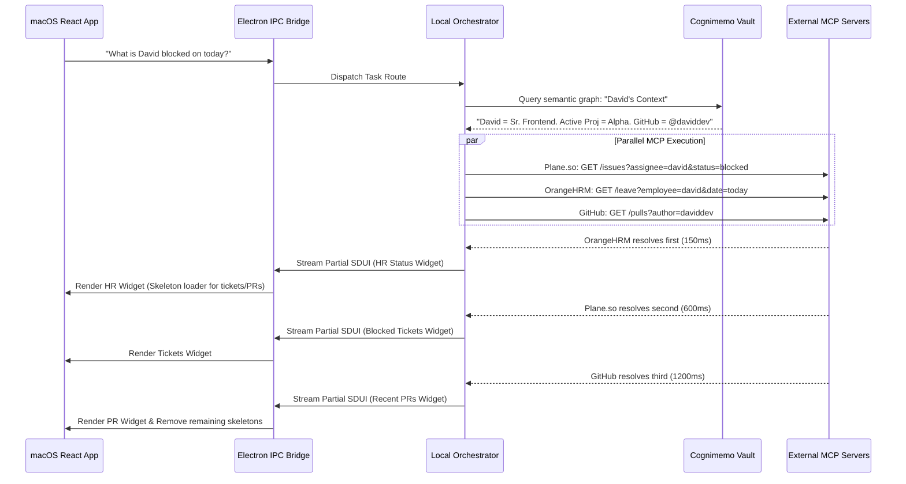

# Master Product & Technical Requirements Document (PRD/TRD)

**Project:** Cursor for Managers (Cognimemo Ecosystem)
**Platform:** macOS Desktop Application (Local-First, Apple Silicon Optimized)
**Target Persona:** Global Managers (Engineering, Sales, HR, Operations, Finance)
**Version:** 2.0 (Master VC & Engineering Spec - Expanded Edition)
**Status:** In Active Development

---

## 1. Executive Summary & Market Thesis

### 1.1 The Premise

"Cursor for Managers" is a local-first, macOS desktop application designed to serve as an AI-driven, intent-based command center. Built as the flagship enterprise use case of the Cognimemo ecosystem, it replaces traditional, fragmented SaaS dashboards with a unified, multimodal workspace.

Rather than forcing the manager to navigate to the data, this platform intelligently pulls context from disparate systems into a unified, ephemeral dashboard generated on the fly based on the manager's immediate intent. It fundamentally shifts the managerial workflow from information gathering to decision execution.

### 1.2 "Why Now?" (The Market Opportunity)

The convergence of three major technological shifts makes this product uniquely viable today:

- **The Model Context Protocol (MCP) Standardization:** Historically, building cross-platform aggregators required maintaining hundreds of brittle, custom REST API wrappers. MCP acts as a universal Rosetta Stone, standardizing how AI agents interact with and execute commands across external SaaS APIs.
- **The Era of Local AI Compute (Apple Silicon):** The proliferation of M-series chips provides unprecedented local processing power (NPU) and unified memory architectures. Running powerful, quantized local LLMs (like Llama 3 8B or Mistral) with low latency is now entirely feasible for the average enterprise user.
- **Peak "SaaS Fatigue":** Modern managers are suffering from an unsustainable cognitive load. The average enterprise utilizes over 130 SaaS applications. Managers currently act as "human APIs"—manually copying context from a Slack thread, pasting it into a Jira ticket, cross-referencing Salesforce, and updating a Notion doc.

Existing enterprise search solutions (like Microsoft Copilot or Glean) are cloud-heavy, inherently slow, and primarily focused on finding information. They lack deep, cross-platform workflow execution. By moving the processing layer locally and leveraging MCP for standard integrations, Cognimemo creates a fast, private, and highly defensible platform for managerial orchestration.

### 1.3 Core Value Proposition

- **Zero Context Switching:** View, analyze, and update across 10+ platforms from a single, omnipresent command bar. Reclaim the estimated 20% of the workweek currently lost to application toggling.
- **Absolute Data Privacy:** Organizational topology, employee performance data, and internal strategy are processed locally. Sensitive context never touches a public cloud LLM provider unless explicitly permitted and anonymized.
- **Intent-to-Action in Seconds:** Replace 15 clicks across 3 web tabs with a single natural language command and a 1-click execution approval. Operations that previously took 10 minutes now take 10 seconds.
- **Temporal Organizational Memory:** The system remembers the relationships between data (e.g., knowing that a specific Stripe error in Datadog corresponds to a specific VIP client in Salesforce and a specific engineering pod in HR).

---

## 2. Target Personas & Core Workflows

To ensure the platform is universally applicable and commands a massive Total Addressable Market (TAM), the architecture must support vastly different daily workflows through dynamic integration hubs. The system must adapt its UI and vocabulary based on the logged-in persona.

### 2.1 Persona A: The Engineering Manager (EM)

**Pain Point:** Chasing down blocked PRs, tracking sprint velocity across Jira/Plane, managing team burnout, and shielding developers from stakeholder noise.

**Core Workflow (The Daily Standup Prep):**

- **Query:** "Who is blocked today, and did the Stripe webhook PR get merged?"
- **Agent Actions:** Queries GitHub/GitLab MCP for PR status, queries Plane.so MCP for blocked tickets, queries OrangeHRM for sick leave, and reads recent PagerDuty alerts.
- **Canvas Result:** A unified Kanban view of only blocked items, alongside a generated summary of the Stripe PR status, and a drafted Slack message to the team DevOps engineer requesting review assistance.

### 2.2 Persona B: The Sales Director

**Pain Point:** Pipeline reviews require cross-referencing Salesforce (deals), Gong (call transcripts), Slack (discount approvals), and email (client sentiment).

**Core Workflow (The Pipeline Triage):**

- **Query:** "Show me deals over $50k stuck in negotiation this quarter and draft discount approvals for the ones with recent activity."
- **Agent Actions:** Queries SuiteCRM MCP for deal stages, pulls recent interaction dates via Gmail MCP, and cross-references with the Cognimemo Vault for Account Owner relations.
- **Canvas Result:** A dynamic grid of high-value stalled deals. Each row features a 1-click "Approve 10% Discount" button that, when clicked, automatically updates the CRM stage, generates a PDF addendum, and notifies the respective sales rep via Slack.

### 2.3 Persona C: The HR & Operations Manager

**Pain Point:** Onboarding, offboarding, and incident management require touching 10 different systems manually, often leading to security compliance gaps.

**Core Workflow (The Onboarding Orchestration):**

- **Query:** "Onboard Alex as a new Senior Frontend Developer starting Monday."
- **Agent Actions:** Hits Google Workspace MCP (create email), Mattermost MCP (add to channels), Plane MCP (assign onboarding tickets), and 1Password MCP (provision vaults).
- **Canvas Result:** A comprehensive checklist of proposed API actions. The manager reviews the generated credentials and clicks a single "Execute All" button, initiating a synchronized sequence of secure API calls.

### 2.4 Persona D: The Finance & Procurement Manager

**Pain Point:** Tracking rogue software spend, approving vendor invoices, and reconciling budgets against actual departmental usage.

**Core Workflow (The Budget Reconciliation):**

- **Query:** "Which engineering SaaS tools are up for renewal next month, and what is our active utilization?"
- **Agent Actions:** Queries NetSuite/QuickBooks MCP for upcoming contract dates, cross-references Okta MCP for active user logins.
- **Canvas Result:** A bar chart comparing contracted seats vs. active logins, highlighting potential areas for down-selling, complete with a drafted email to the vendor requesting a tier adjustment.

---

## 3. Deep System Architecture

The system is a hybrid local/cloud architecture prioritizing speed, privacy, and modularity. It treats the local machine as a sovereign processing node.

### 3.1 The Infrastructure Stack

- **Desktop Wrapper:** Electron (highly optimized for macOS/ARM64 architectures to minimize battery drain and memory footprint).
- **Frontend:** React 18, utilizing BlockSuite for rich, block-based UI rendering, Framer Motion for fluid transitions, and Zustand for lightweight local state management.
- **Backend Bridge (IPC):** Node.js interacting with compiled Rust binaries (via Tauri-style bindings) for heavy data processing, JSON parsing, and vector search.
- **Local Storage:** OctoBase (Rust-based CRDT database) for storing the temporal memory graph, user settings, and encrypted credentials securely on the local disk. It enables offline-first capabilities, allowing the manager to review cached data even without internet access.
- **Local Inference Engine:** Llama.cpp integrated for running quantized models (e.g., `Llama-3-8B-Instruct.gguf`) locally for intent parsing and basic summarization, routing only complex reasoning tasks to external APIs (Claude/OpenAI).

### 3.2 High-Level Architecture Flow

```mermaid
graph TD
    User([Manager]) --> |Cmd+K Query| UI[React / BlockSuite Frontend]
    UI --> |IPC Payload| Orch[Local Node.js/Rust Orchestrator]

    subgraph Local Environment (macOS)
        Orch --> |Fetch Entity Relations| Vault[(Cognimemo Vault / OctoBase)]
        Vault --> |Graph Data| Orch

        Orch --> |Spawn Async Workers| Router{Agent Router}
        Router --> |Worker 1| LocalLLM[Local Llama 3 / Intent Parser]
    end

    subgraph External Network
        Router --> |Worker 2| MCP1[Plane.so MCP]
        Router --> |Worker 3| MCP2[Mattermost MCP]
        Router --> |Worker 4| MCP3[Salesforce MCP]

        MCP1 --> |JSON Live State| Orch
        MCP2 --> |JSON Live State| Orch
        MCP3 --> |JSON Live State| Orch
    end

    Orch --> |Assemble SDUI| Renderer[Server-Driven UI Engine]
    Renderer --> |JSON UI Schema via IPC| UI
```

### 3.3 The Asynchronous Orchestrator Pipeline

To achieve the critical <2000ms Time-To-First-Byte (TTFB) for visual feedback, the Orchestrator completely avoids traditional sequential "chain-of-thought" LLM polling. Instead, it relies on concurrent API execution and partial UI streaming.



**Fallback Mechanism:** If an MCP server times out or is offline, the Orchestrator gracefully handles the failure by rendering a `WidgetErrorState` in that specific Canvas zone, rather than crashing the entire dashboard.

---

## 4. Model Context Protocol (MCP) Integration Specs

Cognimemo relies entirely on the open-source community providing MCP servers. We deliberately do not maintain custom API wrappers, ensuring the core application remains lightweight and agnostic.

### 4.1 MCP Discovery & Registration

When a user adds an integration, they provide an MCP Server command path (e.g., `npx -y @modelcontextprotocol/server-slack`). The Orchestrator initiates an `initialize` handshake, requesting the server's capabilities and schema.

**Example Tool Registration** (What the Orchestrator learns via JSON RPC):

```json
{
  "tools": [
    {
      "name": "plane_get_blocked_issues",
      "description": "Fetches blocked issues for a specific user in Plane.so. Use this when asking for blockers or stuck tasks.",
      "inputSchema": {
        "type": "object",
        "properties": {
          "assignee_email": { "type": "string", "description": "The target employee's email" },
          "project_id": { "type": "string", "description": "Optional boundary for the query" }
        },
        "required": ["assignee_email"]
      }
    },
    {
      "name": "mattermost_send_dm",
      "description": "Sends a direct message to a user on Mattermost. ALWAYS requires human approval.",
      "inputSchema": {
        "type": "object",
        "properties": {
          "username": { "type": "string" },
          "message": { "type": "string" }
        },
        "required": ["username", "message"]
      }
    }
  ]
}
```

### 4.2 Deep Cross-Platform Context Merging

The true moat of the platform is intelligent data mapping. If the agent receives a Stripe `Transaction_ID` from a financial MCP, it can autonomously pass that string into a Salesforce MCP to find the associated `Account_ID`, and then pass that `Account_ID` into a Zendesk MCP to pull recent support tickets.

The Cognimemo Vault acts as the intelligent translation layer, holding the semantic mappings (e.g., knowing that the column `assignee_email` in Plane maps to the user node `Employee_Email` in the Vault).

---

## 5. UI/UX Paradigm & Generative Interface

To accommodate infinite workflows without infinite custom code, the UI utilizes a Server-Driven UI (SDUI) paradigm on top of a three-zone layout.

### 5.1 The Three-Zone Layout Strategy

- **Left Navigation (The Ecosystem):** A vertical, collapsable stack of connected integrations (The App Directory). It also houses saved workflows (e.g., "Morning Standup Dashboard").
- **Center Canvas (The Work Surface):** A dynamic, fluid grid that renders the SDUI components. It is ephemeral—it builds itself based on the query, and clears out when a new query is executed.
- **Right Sidebar (The Co-Pilot):** A persistent chat interface containing the conversational history, reasoning trace, and natural language refinements (e.g., "Filter those tickets to only show critical priorities").

### 5.2 UI Wireframes & Interactions

#### Global Command State (The Omnibar)

Triggered globally via `Cmd+K` from anywhere in macOS. Supports keyboard-first navigation (arrow keys to select contexts).

```
================================================================================
|                                                                              |
|  [ 🔍 "Draft an update on Project Alpha for the executive channel..."      ] |
|                                                                              |
|  Suggested Contexts to Include (Auto-detected based on intent):              |
|  [x] Plane.so: Alpha closed tickets (Last 7 days)                            |
|  [x] GitHub: Recent main branch deployments                                  |
|  [ ] OrangeHRM: Team PTO calendar                                            |
|                                                                              |
|                                                     [ Generate Update ⏎ ]    |
================================================================================
```

#### The Dynamic Canvas & Agent Co-Pilot (Post-Query State)

Once executed, the main window opens, rendering the requested widgets and requiring approval for the write action.

```
+-----------------------------------------------------------------------------+
| 💼 CURSOR FOR MANAGERS                                    [⚙️ Settings] [👤] |
+-----------+-----------------------------------------+-----------------------+
| APPS      | THE CANVAS: Project Alpha Update        | COGNIMEMO AGENT       |
|           |                                         |                       |
| ⌘ Home    | [ 📝 Drafted Executive Summary ]        | > You: Draft an       |
|           | "Team Alpha successfully deployed the   |   update on Alpha for |
| ⚡️ Plane  | new payment gateway. We closed 14       |   the exec channel.   |
|           | tickets, but are blocked on DB          |                       |
| 💬 Chat   | migrations by the Devops team."         | *Agent:*              |
|           |                                         | I gathered the data   |
| 🤝 CRM    | [ 📊 Velocity Chart (Plane.so) ]        | from Plane & Git. I   |
|           |  █████████░░ 90% Completed              | have drafted the      |
| 🌴 HR     |  Trend: Up 12% week-over-week           | message.              |
|           | +-------------------------------------+ |                       |
| + Add App | | ⚠️ PENDING ACTION APPROVAL          | | Review the draft on   |
|           | | Send to Mattermost: #exec-updates   | | the canvas and click  |
|           | | Payload size: 42 words              | | Approve to send.      |
|           | | [ Cancel ]       [ ✅ SEND ]        | |                       |
|           | +-------------------------------------+ |                       |
+-----------+-----------------------------------------+-----------------------+
```

---

## 6. Technical Specifications: Server-Driven UI (SDUI) Contract

To ensure the core macOS application never becomes bloated or vulnerable to malicious community UI code, developers do not write React or HTML. The local Orchestrator maps JSON responses from MCP servers directly into our native, highly-optimized React UI Kit.

### 6.1 The Core Component Registry

The React frontend is locked down. It only knows how to render the following strict components, managed by a grid layout engine:

| Component | Description |
|---|---|
| `WidgetList` | A vertically scrolling list with optional metadata tags and action buttons. |
| `WidgetBoard` | A Kanban-style column layout for statuses. |
| `WidgetMetric` | KPI blocks with trend indicators (red/green micro-charts). |
| `WidgetForm` | Input fields for user overrides before a POST request. |
| `WidgetChart` | Standardized bar, line, and pie charts leveraging a library like Recharts. |
| `WidgetMarkdown` | For rendering rich text summaries, tables, and code snippets. |
| `WidgetActionBlock` | The critical Human-in-the-Loop approval component. |

### 6.2 The JSON SDUI Contract Payload

When the backend resolves its tasks, it sends this payload over the IPC bridge to React. React utilizes a diffing algorithm to update components efficiently without full screen repaints.

```json
{
  "view_id": "v_772991",
  "layout_type": "masonry",
  "components": [
    {
      "id": "c_metric_1",
      "component": "WidgetMetric",
      "props": {
        "title": "Stalled Deals",
        "value": "$145,000",
        "trend_direction": "negative",
        "trend_text": "Up $20k from yesterday",
        "icon": "alert-triangle"
      }
    },
    {
      "id": "c_list_1",
      "component": "WidgetList",
      "props": {
        "title": "Attention Required",
        "items": [
          {
            "id": "deal_992",
            "title": "Acme Corp Enterprise License",
            "subtitle": "Last touched: 14 days ago",
            "metadata": { "badge": "High Priority", "color": "red" },
            "actions": [
              {
                "label": "Ping Account Exec",
                "type": "mcp_execute",
                "tool": "mattermost_send_dm",
                "payload": { "username": "sarah_sales", "message": "Update on Acme?" }
              }
            ]
          }
        ]
      }
    }
  ]
}
```

---

## 7. Security, Trust & Defensibility

Enterprise software sales live or die by the security audit. The architecture assumes that AI hallucination is inevitable and builds robust, verifiable safeguards around it. This is a **"Zero-Trust Agent Execution Environment."**

### 7.1 Human-in-the-Loop (HITL) Imperative & Audit Trails

- **Read-Only Independence:** The agent is authorized to chain multiple GET and READ MCP tools autonomously to build the Canvas context.
- **Write Lock:** Any MCP tool mapped with `type: "mutation"` or `action: "write"` triggers an absolute system halt. The UI must render a `WidgetActionBlock` requiring a physical mouse click by the Manager.
- **Audit Logging:** Every approved action is cryptographically hashed and saved in a local, tamper-evident SQLite/OctoBase ledger. A manager can always review "Actions taken by Agent on Jan 14th."

### 7.2 Credential & Token Management

- API keys are encrypted using AES-256-GCM and stored securely within the macOS Keychain (utilizing the device's Secure Enclave).
- Access tokens are held in volatile memory (RAM) during active sessions and are instantly flushed upon application exit or sleep.
- The Cognimemo Vault (OctoBase) is heavily encrypted at rest, ensuring that if a laptop is stolen, the organizational topography remains secure.

### 7.3 Defending Against Prompt Injection

The system is practically immune to external prompt injection vectors (e.g., a malicious hidden tag on a website) because:

- It lacks a general web browser. It cannot navigate to or parse `malicious-site.com`.
- It interacts strictly with structured, typed JSON from authorized internal MCP servers (e.g., Jira, HR systems). There is no "open internet" text parsing vector.
- The LLM parsing logic isolates API response text from system command execution, treating fetched strings purely as variable data rather than executable instructions.

---

## 8. Development Roadmap & Phased Rollout

### Phase 1: The Core MVP (Months 1–2)

**Goal:** Prove the Asynchronous Orchestrator latency, the local Vault connection, and the SDUI Canvas rendering.

**Scope:**
- Fork AFFiNE and gut the document editor, leaving the React/Rust shell.
- Build the IPC bridge and React SDUI renderer.
- Implement local OctoBase graph storage.
- **Integrations:** Build and connect internal MCP servers for Plane.so (Tasks) and Mattermost (Chat) only.
- **UX:** Basic `Cmd+K` global shortcut, List/Metric widgets, and the basic Agent chat sidebar.

### Phase 2: The Enterprise Sandbox (Months 3–4)

**Goal:** Expand utility across departments and harden the security layer.

**Scope:**
- Add external LLM routing (Deep reasoning via Claude 3.5 Sonnet API for complex planning, falling back to local Llama 3 for basic parsing).
- Expand UI component library (Kanban boards, Forms, Charts).
- **Integrations:** Add CRM (SuiteCRM/Twenty) and HR (OrangeHRM) support.
- Implement the strict "Pending Action Approval" HITL flow and local audit logging.

### Phase 3: The Community Platform (Months 5–6)

**Goal:** Create a defensible moat via ecosystem network effects.

**Scope:**
- Publish the official "Cognimemo MCP Standard" SDK and documentation.
- Allow third-party developers to submit custom MCP configurations via a decentralized registry.
- Launch "Agent Workflows"—allowing managers to save complex, multi-step prompts (e.g., "Run Weekly Sync Prep") as 1-click automations pinned to the Left Navigation.

### Phase 4: Enterprise Fleet Management (Months 7+)

**Goal:** Scale from individual managers to organizational deployments.

**Scope:**
- Develop an Admin Console for IT teams to mass-deploy the application via MDM (Mobile Device Management).
- Enable "Pre-configured Vaults" so new managers instantly inherit the organizational graph without starting from scratch.
- Implement SSO (Single Sign-On) integration for vault decryption.

---

*Prepared for rapid, local-first development cycles.*
